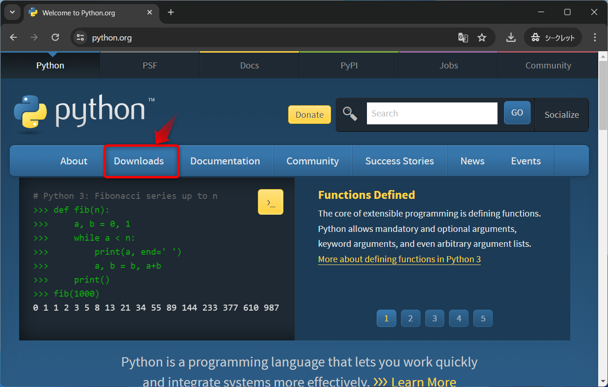

# Python

## インストールの手順

### ダウンロード

下記サイトからPythonをダウンロードする  
https://www.python.org/

`Downloads`をクリック


`Python 3.xx.xx`をクリックする


`ダウンロード`フォルダに保存する


### インストール

ダウンロードしたファイルを実行  


`Add python.exe to PATH`にチェックを入れて`Install Now`をクリック  


インストールされるので待つ  


`Close`をクリック  


### インストールの確認

コマンドプロンプトから下記コマンドを実行して、インストールの確認をする  
インストールしたPythonのバージョンが表示されたらOK

```bash
python -V
```


## 別バージョンのPythonをインストールする

今回はVer3.10系をインストールする  
※1台のPCに複数バージョンのPythonをインストールできる  
※Pythonライブラリには、特定のバージョンでしか動かないモノもある

### ダウンロード

下記サイトからPython3.10系をダウンロードする  
https://www.python.org/

`Downloads`をクリック


`View the full list of download.`をクリック


下にスクロールする


`Looking for a specific release?`に過去のバージョンが用意されている  
欲しいバージョンを探す


今回は`Python 3.10.11`をインストールするので探す


見つけたら`Python 3.10.11`の`Download`をクリックする


下の方にスクロールする


`Files`にある`Windows installer (64-bit)`をクリックしてダウンロードする


`ダウンロード`フォルダに保存する


### インストール

ダウンロードしたファイルを実行


今回は`Add python.exe to PATH`にチェックを入れないで`Install Now`をクリック  


インストールされるので待つ  


`Close`をクリック  


### Pythonのバージョン切り替え

[こちら](README-VENV.md)を参照